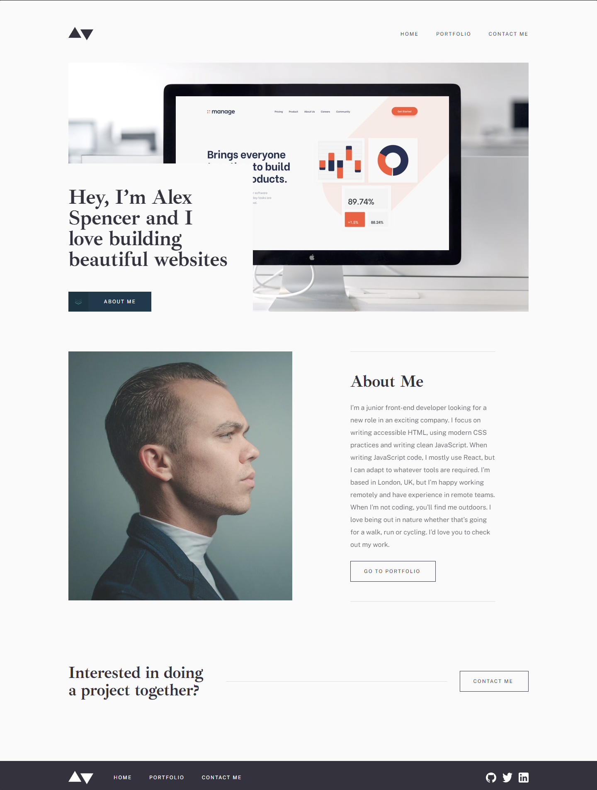

# Frontend Mentor - Minimalist portfolio website solution

This is a solution to the [Minimalist portfolio website challenge on Frontend Mentor](https://www.frontendmentor.io/challenges/minimalist-portfolio-website-LMy-ZRyiE). Frontend Mentor challenges help you improve your coding skills by building realistic projects. 

## Table of contents

- [Overview](#overview)
  - [The challenge](#the-challenge)
  - [Screenshot](#screenshot)
  - [Links](#links)
- [My process](#my-process)
  - [Built with](#built-with)
  - [What I learned](#what-i-learned)
  - [Continued development](#continued-development)
  - [Useful resources](#useful-resources)
- [Author](#author)

## Overview

### The challenge

Users should be able to:

- View the optimal layout for each page depending on their device's screen size
- See hover states for all interactive elements throughout the site
- Click the "About Me" call-to-action on the homepage and have the screen scroll down to the next section
- Receive an error message when the contact form is submitted if:
  - The `Name`, `Email Address` or `Message` fields are empty should show "This field is required"
  <!-- - The `Email Address` is not formatted correctly should show "Please use a valid email address" -->

### Screenshot

### Links

- Solution URL: [Add solution URL here](https://www.frontendmentor.io/solutions/responsive-portfolio-using-react-typescript-ftT75dnPGf)
- Live Site URL: [Add live site URL here](https://rravg.github.io/minimalist-portfolio-website/#/)

## My process

### Built with

- Semantic HTML5 markup
- CSS custom properties
- Flexbox
- Mobile-first workflow
- [React TypeScript](https://reactjs.org/) - JS library 
- CSS modules
- React Router
- React Responsive

### What I learned

In this project I used a different approach to style componen with CSS modules instead of plain CSS to avoid name collitions. I used React Router to route each page and project and React Responsive to change with React the behaviour of some page, this was specially usefull in creating the NavBar for example.

### Continued development

In the next project I may use Styled Components in order to have a better idea of all the styling methods that exist with React and choose the one that I think is better based on my experience.

### Useful resources

- [W3 School](https://www.w3schools.com) - This website is an excellent reference, specially the How To section.
- [React TypeScript](https://react-typescript-cheatsheet.netlify.app) - This site provides a reference for React TypeScript projects, on how to type props, hooks, etc.

## Author

- GitHub - [Rodrigo Villalobos](https://github.com/Rravg)
- Frontend Mentor - [@Rravg](https://www.frontendmentor.io/profile/Rravg)
